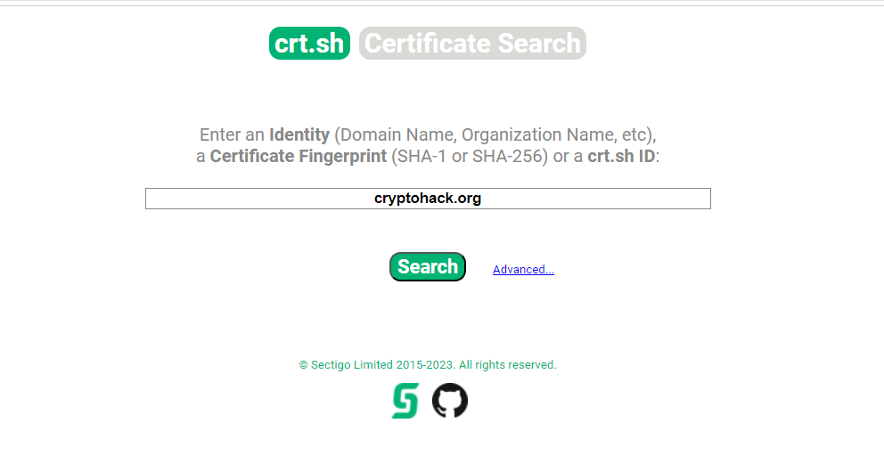
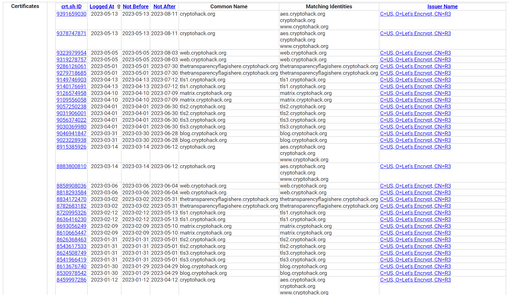
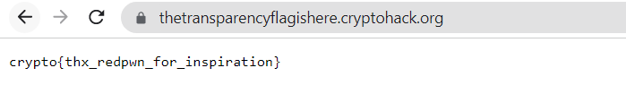

# Transparency

The challenge gives us an RSA public key in PEM format

```
-----BEGIN PUBLIC KEY-----
MIIBIjANBgkqhkiG9w0BAQEFAAOCAQ8AMIIBCgKCAQEAuYj06m5q4M8SsEQwKX+5
NPs2lyB2k7geZw4rP68eUZmqODeqxDjv5mlLY2nz/RJsPdks4J+y5t96KAyo3S5g
mDqEOMG7JgoJ9KU+4HPQFzP9C8Gy+hisChdo9eF6UeWGTioazFDIdRUK+gZm81c1
iPEhOBIYu3Cau32LRtv+L9vzqre0Ollf7oeHqcbcMBIKL6MpsJMG+neJPnICI36B
ZZEMu6v6f8zIKuB7VUHAbDdQ6tsBzLpXz7XPBUeKPa1Fk8d22EI99peHwWt0RuJP
0QsJnsa4oj6C6lE+c5+vVHa6jVsZkpl2PuXZ05a69xORZ4oq+nwzK8O/St1hbNBX
sQIDAQAB
-----END PUBLIC KEY-----

```

It told Find the subdomain of cryptohack.org which uses these parameters in its TLS certificate, and visit that subdomain to obtain the flag.

I dont know what to do with the public key file, i can just extract some key informationb but not the domain

Searching google about finding the subdomain then i found out a website that search for certificates of a domain [crt.sh](https://crt.sh/)

Then i search the domain `cryptohack.org`



Result



Then i found a subdomain that seems to be the answer


Visit the site the i get the flag


